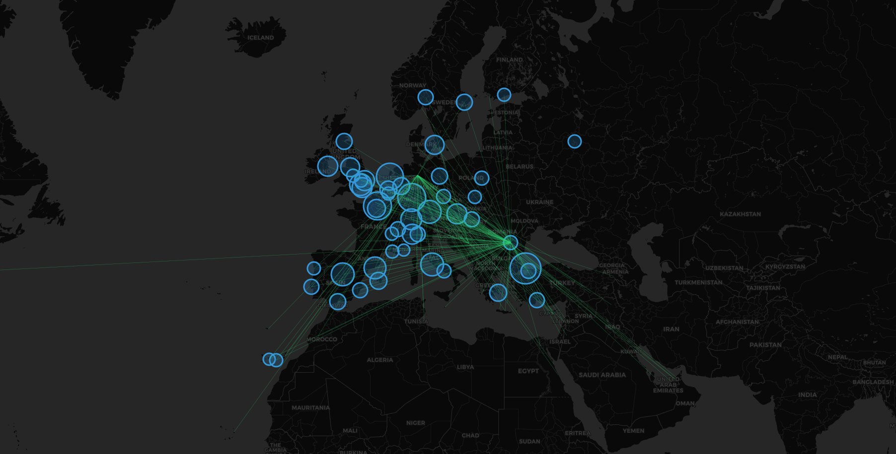

# ✈️ Europe Flight Network Analysis & Route Optimizer

## 📌 Project Overview
This project applies **Graph Theory** and **Network Analysis** to analyze 18,000+ flight routes across Europe. Using Python and NetworkX, I built a tool that identifies key aviation hubs and calculates optimal flight paths between non-connected cities using **Dijkstra's algorithm**.

**Dataset:** 18,111 routes covering 260 major European airports.

## 📊 Key Findings & Visualization

### 1. Network Connectivity Map
*Visualizing the density of air traffic across Europe. Major hubs are highlighted based on Degree Centrality.*


### 2. Top 5 Busiest Hubs (Bottleneck Analysis)
I calculated **Degree Centrality** to identify the most critical airports in the network:
1.  **IST (Istanbul):** 307 connections
2.  **FRA (Frankfurt):** 284 connections
3.  **CDG (Paris):** 277 connections
4.  **AMS (Amsterdam):** 269 connections
5.  **FCO (Rome):** 233 connections

### 3. Route Optimization Algorithm
*Example Scenario:* Finding a path from **Shannon, Ireland (SNN)** to **Athens, Greece (ATH)**.
* *Direct Flight:* None available.
* *Algorithm Output:* **SNN -> CFU (Corfu) -> ATH**
* *Method:* Shortest path calculation using weighted edges (flight duration).

## 🛠️ Tech Stack
* **Python:** Data Processing & Logic.
* **NetworkX:** Graph algorithms (Shortest Path, Centrality).
* **Folium:** Interactive Geospatial Visualization.
* **Pandas:** Data Cleaning & ETL.

## 🚀 How to Run
1.  **Install Dependencies:**
    ```bash
    pip install -r requirements.txt
    ```
2.  **Run the Analysis:**
    ```bash
    python main.py
    ```
3.  **View the Map:**
    Open `flight_network_map.html` in your browser.